# Windows 10/ 11 下安全并正确地使用 SMB 共享  

```
https://post.smzdm.com/p/akxwkxqk/
Windows 10_ 11 下安全并正确地使用 SMB 共享
```

大家在日常的工作和生活中应该多多少少都需要用到局域网共享，对于 Windows 用户来说那自然是离不开 SMB 共享了，比如说在公司局域网共享文件和打印机，家里的 NAS 开个共享给 Windows 系统访问数据等。

## 一、不要使用 SMB1  

> SMB1 可以追溯到20世纪80年代 IBM 和 微软 DOS 时代，距离今天已经有三十多年的时间，当时计算机安全还不存在，它在拦截攻击方面有重大的架构问题 。

如今版本的 windows 10/11 都默认禁用了 SMB1，因此如果你还在使用这一协议的话，建议你去关闭，方法如下：

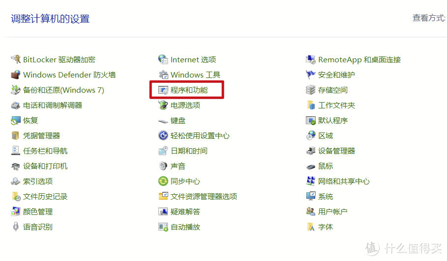

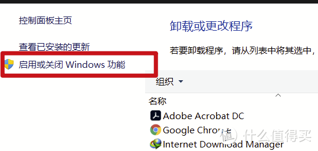

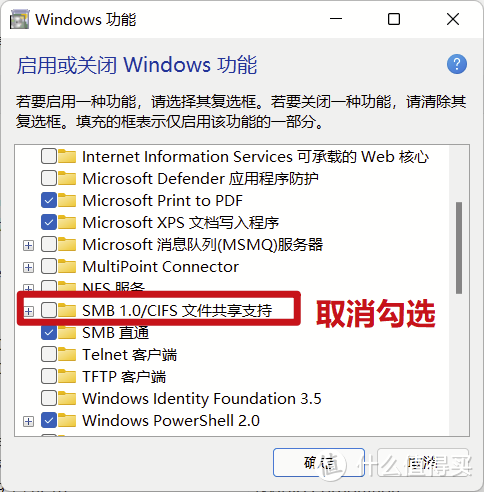

## 二、安全使用 SMB 共享的步骤  

SMB 安全是一个可以聊三天三夜的话题，但多数人不需要涉及到深层面的安全运维设置，但如果你感兴趣，可以从下面的参考资料开始了解：

[How to Defend Users from Interception Attacks via SMB Client Defense](https://go.smzdm.com/694444eceb20c89e/ca_aa_yc_163_akxwkxqk_14197_0_1641_0)

[Beyond the Edge: How to Secure SMB Traffic in Windows](https://go.smzdm.com/1a3463dea99ce5eb/ca_aa_yc_163_akxwkxqk_14197_0_1641_0)

一个简单的，可以在工作或家庭的局域网中显著提高安全性且不会太复杂的 SMB 共享设置方法：

    1. 新建一个用户专门用于共享文件的授权，并合理设置此用户的权限；

    2. 合理设置网络共享和系统安全的相关设置；

    3. 开启共享，授权指定用户；

    4. 手动添加证书，采用“映射网络驱动器”的方式访问共享。

## 三、创建专用的用户  

我们来给系统新建一个本地用户，此用户只用在 SMB 共享。

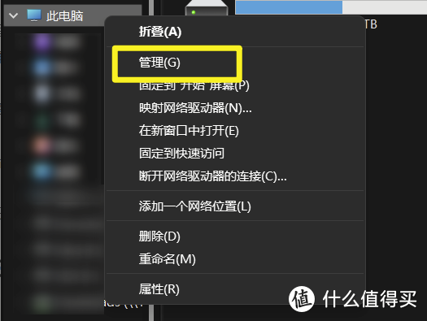

> 右键我的电脑

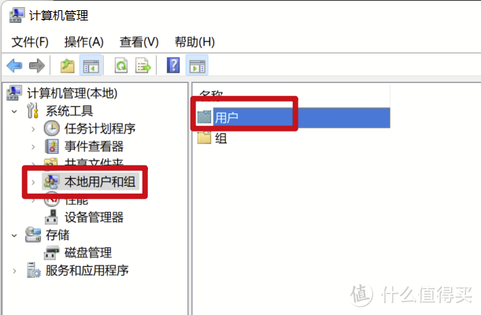

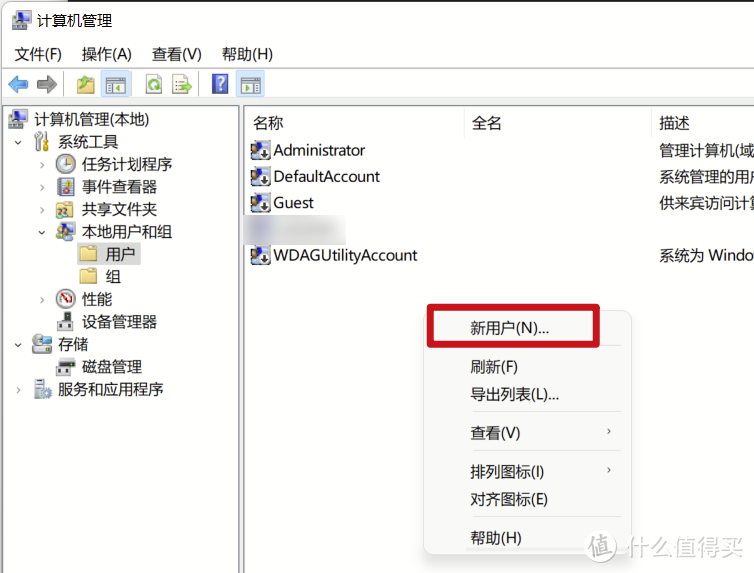

> 右键空白处，点击“新用户”

新建了一个账号为 "joker" 的用户，相关设置如下：

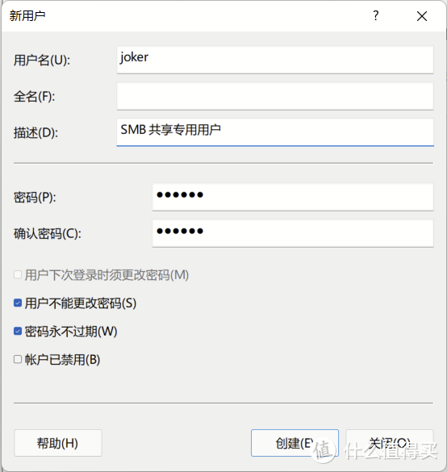

> 由于只是用于共享，因此可以设置不能更改密码，且密码不会过期

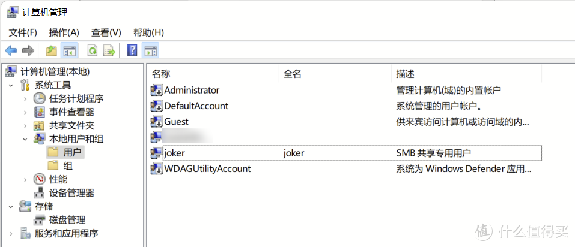

## 四、合理设置网络共享和系统安全的相关设置

### 1. 禁用“启用不安全的来宾登录”

默认情况下，在 SMB2 和 SMB3 版本中，Windows 10 / 11 系统下是禁用此服务的，按照本文的思路，如果你开启了我建议你关闭，步骤如下：

按住 windows 键 + R，在弹出的“运行”窗口中输入 gpedit.msc 打开“本地组策略编辑器”：

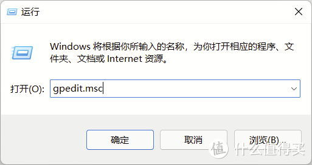

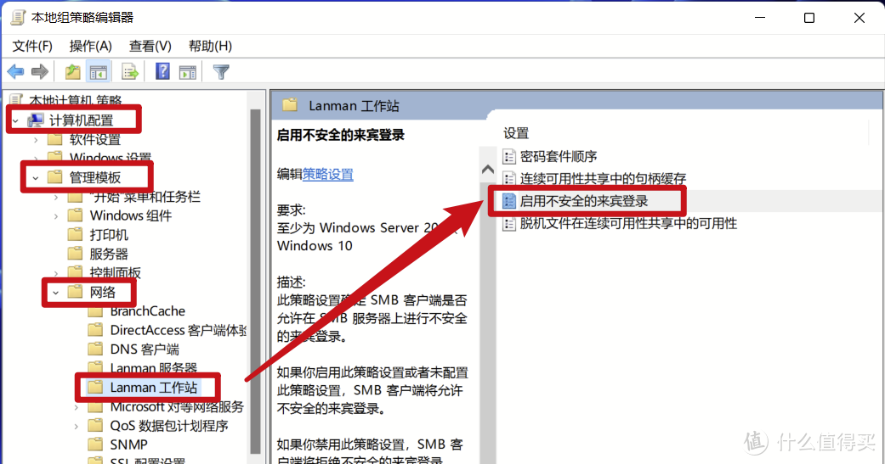

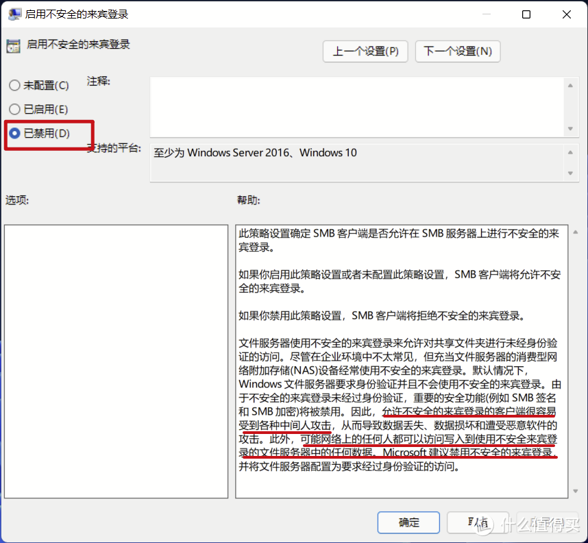

> 微软也明确说明了，开启此项功能会产生很大的安全漏洞

为什么要禁用？因为很容易遭受中间人攻击。

简单来说，在你使用 SMB1 协议去共享文件时，虽然别人访问你的共享文件时 SMB1 会去验证访问者提供的用户证书是否有效，但是如果验证此证书为无效之后，SMB1 将会尝试开启“来宾”（guest）登录模式，允许访问者以“来宾”（guest）的身份进行登录。

换句话说，就相当于 **“我不认识你，也不知道你是好人还是坏人，但是来者皆视为宾客”。**

所以你知道为啥要关闭这个设置了吧？

很多教程都会教用户开启此项设置开解决某些 SMB 问题（比如说下图），真心不建议。

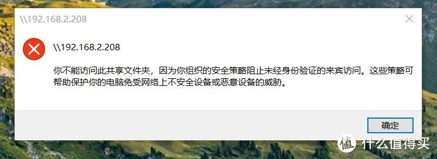

> 图片网络

上图产生的错误，就是因为我们禁用了“来宾”身份的登录，**但是大家不要认为这是不好的结果，恰恰相反，我们禁用此项功能就是为了实现这个目的——更好地保护我们的 SMB 共享资料安全。**

那么该如何正确的使用 SMB 共享，请继续往下看。

### 2. 合理分配用户权限

同样的，使用“运行”窗框输入 secpol.msc 打开 “本地安全策略”设置窗口：

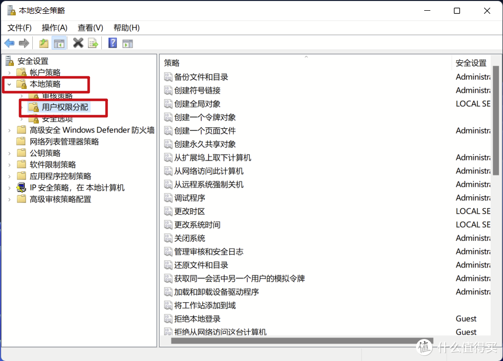

#### （1）授予用户“从网络访问此计算机”的权限：

```
“从网络访问此计算机”指只有授权的用户能够通过网络来访问到本机上的共享文件资源（包括共享的打印机）
```

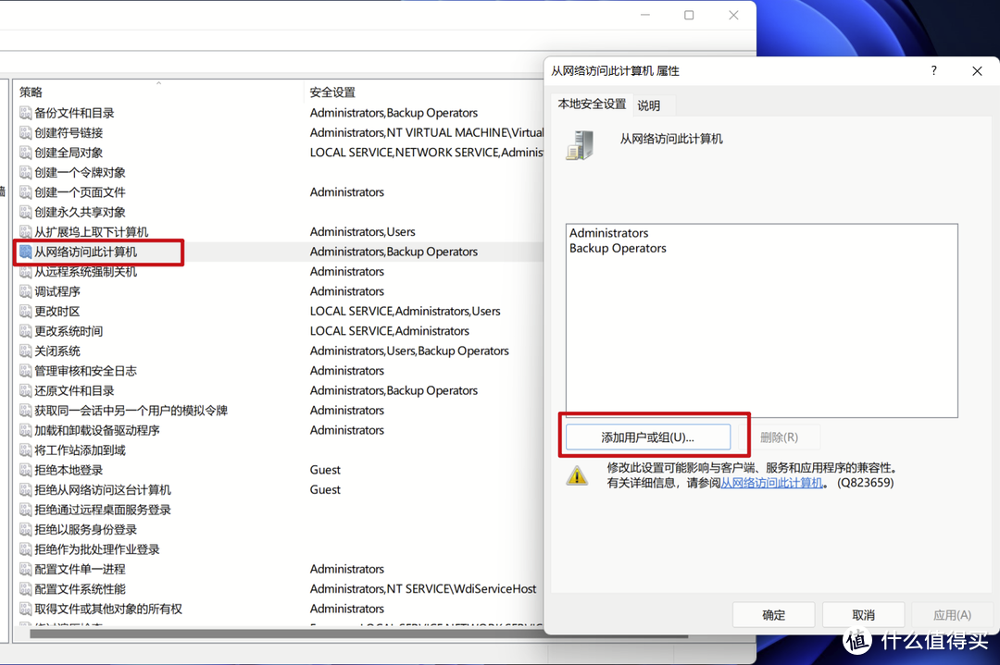

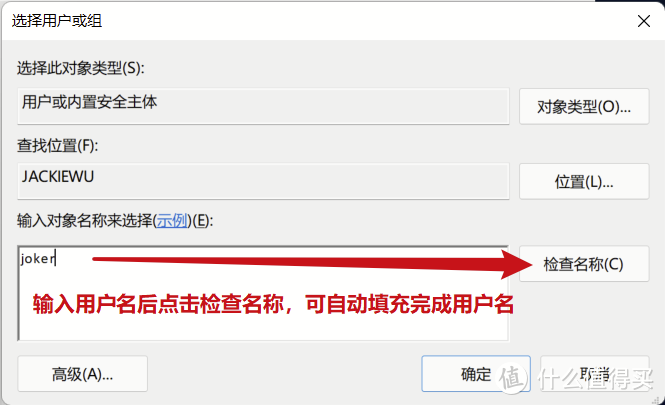

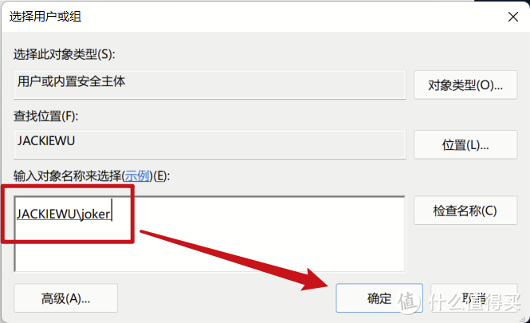

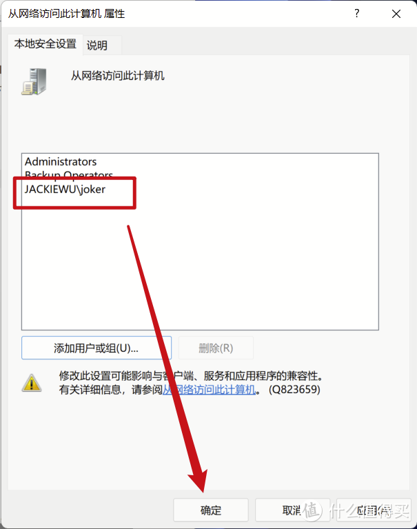

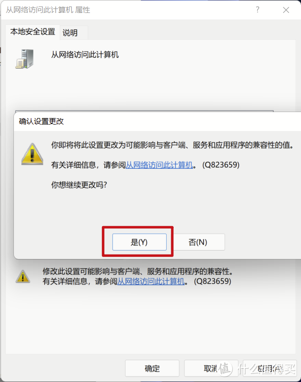

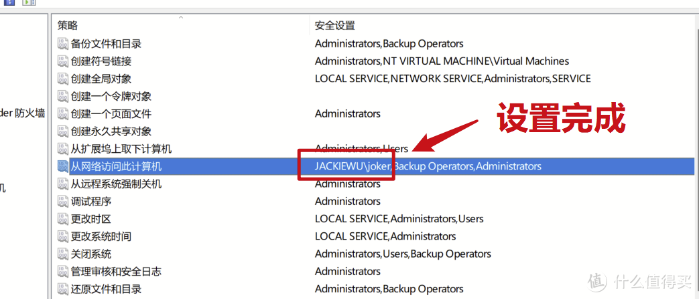

#### （2）限制此用户登录到系统上：“拒绝本地登录”和“拒绝通过远程桌面服务登录”

按照同样的方法，将此用户添加到以下两项设置的名单中：

> **拒绝本地登录**：即不允许特定用户在本电脑上进行登录

> **拒绝通过远程桌面服务登录**：即不允许此账户使用远程桌面登录到本系统

设置好之后，joker 用户就无法本地登录到系统，同时也无法通过远程桌面的形式登录到本机，因为我们的目的就是让 joker 只能用来使用 SMB 共享。

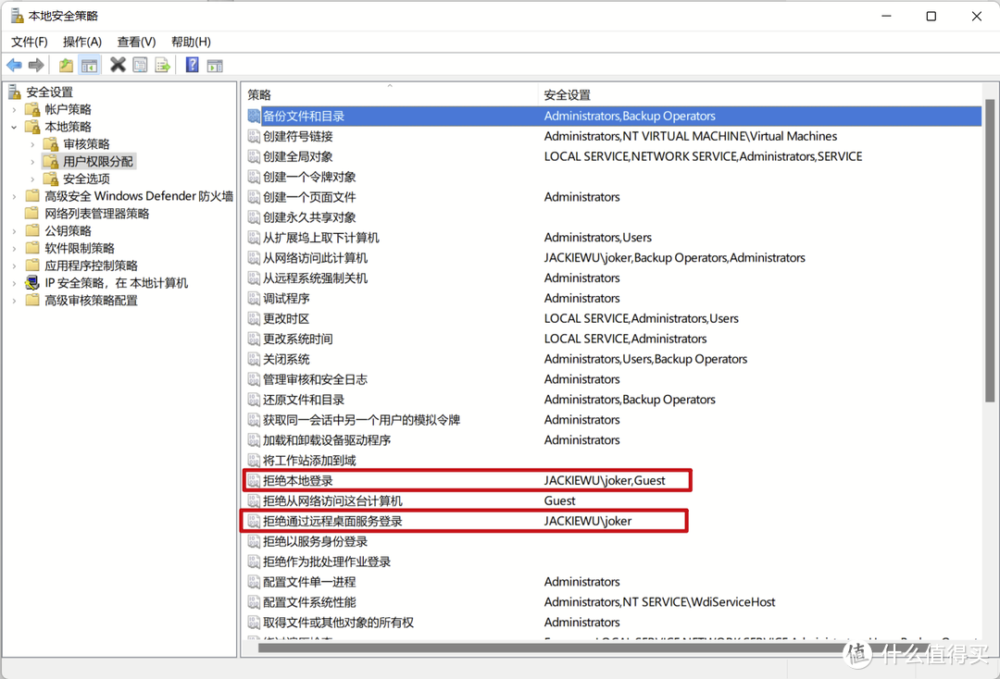

### 3. 本地安全选项设置

请参考下图的设置进行设置：

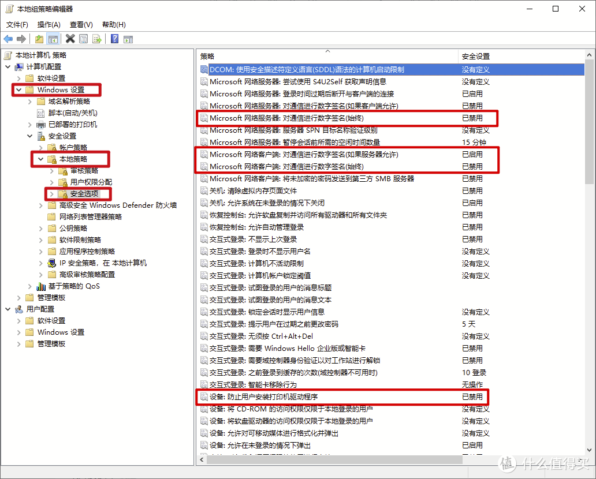

>  **Microsoft网络服务器：对通信进行数字签名(始终) —— 禁用**

    此项设置用来确定 SMB 的数据包是否需要进行数字签名（类似于加密的意思），用来防止中间人攻击。比如说当我们设置了一个文件夹的 SMB 共享，那么当网络里面的其他人（相当于客户端）来想要访问我们的这个文件夹时，我们（相当于服务端）就会要求其他人也开启 SMB 数字签名的功能，否则我们不允许他们来访问我们的文件夹（不允许建立连接）。对于一般人来说是不需要开启的，除非你有很明确的理由。

    默认情况下此项设置处于禁用状态，一般情况下也不需要打开。如果你打开了，说明要么你是专业人士，要么是误打误撞开启了这个选项，在你不理解这个设置背后的逻辑情况下，我建议你关掉，否则会产生访问错误。

>  **Microsoft网络客户端：对通信进行数字签名(如果服务器允许) —— 启用**

    建议打开，原因是我们在访问别人的 SMB 共享文件夹时，如果对方（服务器端）要求数字签名，那么如果此项设置没有启用，对方的服务器就不会允许我们（客户端）进行连接。

>  **Microsoft网络客户端：对通信进行数字签名(始终) —— 禁用**

    默认情况下是关闭的，建议不要打开。如果开启了，并且服务器端没有启用数字签名，那么将无法实现访问 —— 因为我们坚持要对 SMB 数据包进行数字签名，不签名不访问。

>  **设备：防止用户安装打印机驱动程序 —— 禁用**

    假如开启了此项设置，那么当你共享了一个打印机让别人来使用时，别人将没有办法直接从你这边下载这个打印机的驱动（除非别人用的是你电脑的管理员账号，否则无法下载驱动），建议关闭（默认也是关闭的）。

**重点，请将 “网络访问：本地账户的共享和安全模型” 设置为 “经典-对本地用户进行身份验证，不改变其本来身份”**

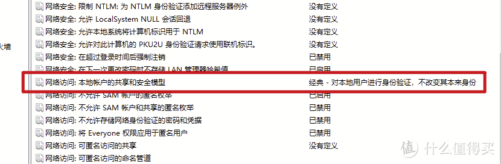

很多教程会教你选择第二个选项 —— “仅来宾-对本地用户进行身份验证，其身份为来宾”来解决某些问题，但跟我前面说的一样，“来宾”身份存在很大的安全漏洞，不建议设置。

微软在这一项设置中也明确说明了具体的细节：

    此安全设置确定如何对使用本地帐户的网络登录进行身份验证。如果将此设置设为“经典”，使用本地帐户凭据的网络登录通过这些凭据进行身份验证。
    
>  **“经典”模型能够对资源的访问权限进行精细的控制。通过使用“经典”模型，你可以针对同一个资源为不同用户授予不同类型的访问权限。**

>  **如果将此设置设为“仅来宾”，使用本地帐户的网络登录会自动映射到来宾帐户。使用“仅来宾”模型，所有用户都可得到平等对待。**
    
    所有用户都以来宾身份进行验证，并且都获得相同的访问权限级别来访问指定的资源，这些权限可以为只读或修改。

>  **使用“仅来宾”模型时，所有可以通过网络访问计算机的用户(包括匿名 Internet 用户)都可以访问共享资源。**
    
    你必须使用 Windows 防火墙或其他类似设备来防止对计算机进行未经授权的访问。同样，使用“经典”模型时，本地帐户必须受密码保护；否则，这些用户帐户可以被任何人用来访问共享的系统资源。

至此，我们用户和系统的相关设置已经处理完毕，接下来我们来设置“网络和共享中心”。

## 五、“网络和共享中心”：开启有保护的共享

打开共享设置：

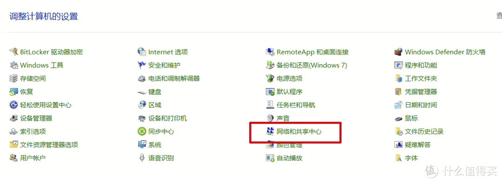

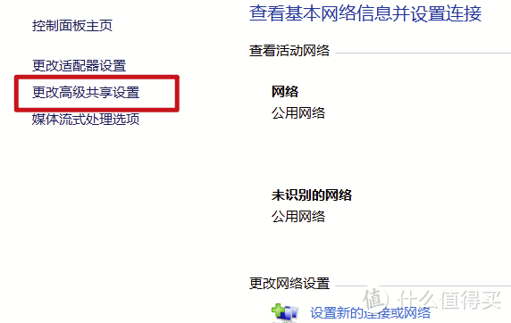

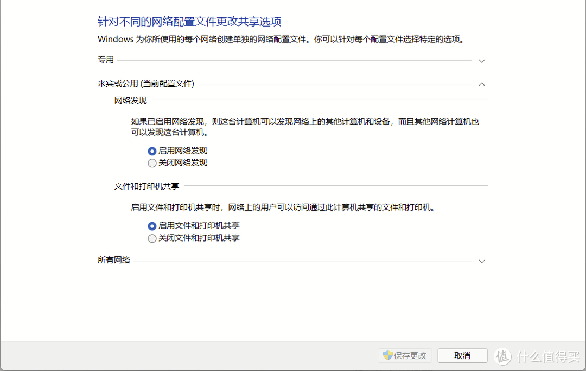

下面讲解一下上面相关共享设置的作用：

### 1. “启用网络发现”：其实可以不用开启

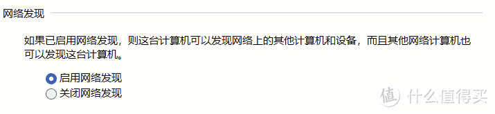

当你勾选此项设置，那么当你在使用“网络”面板时就能发现同局域网下面的其他主机（对方也要开启网络发现）：

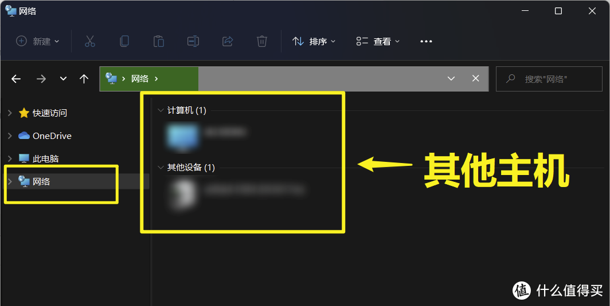

> 如果不启用将无法查看，但其实影响不大

其实这一项设置不开启也是没问题的，不影响我们去做 SMB 共享，而且关闭此项设置能将我们从其他 Windows 主机的网络面板中隐藏起来，提高安全性。

### 2. 启用“文件和打印机共享”

如果不开启，是无法实现 SMB 共享的，因此需要启用：

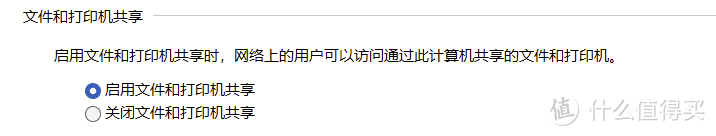

### 3. 启用密码保护

这就不必多说了，密码保护必定要开启。

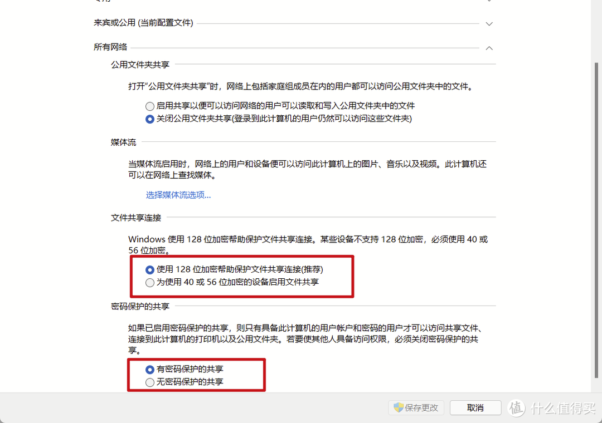

## 六、设置 SMB 共享

这里我们新建了一个 "share" 文件夹，我们将对此文件夹开启共享：


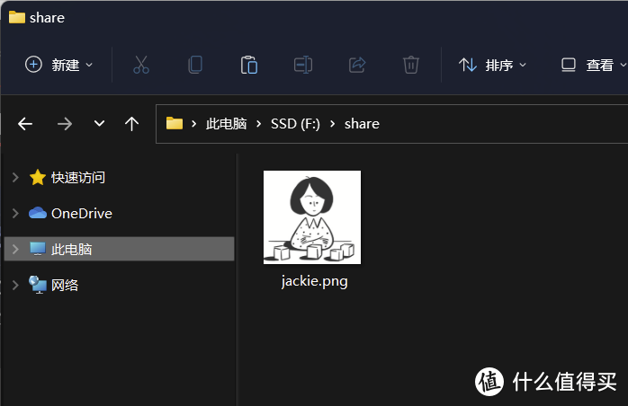

> 文件夹里面有一张图片文件夹里面有一张图片

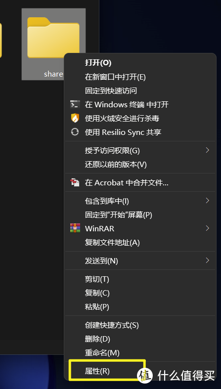

> 右键文件夹，点击“属性”

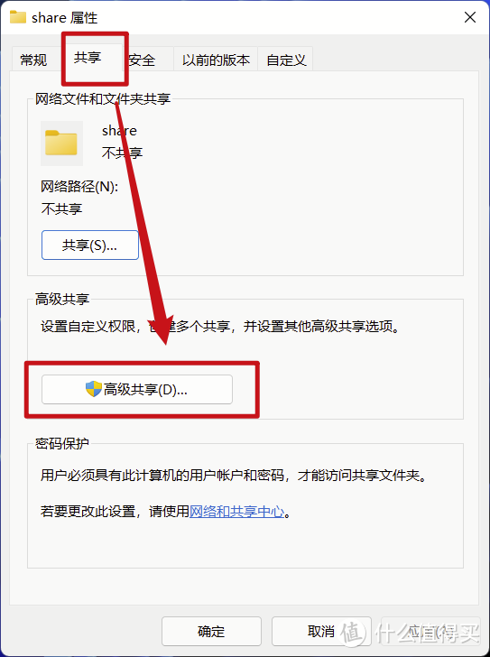

> 点击“高级共享”

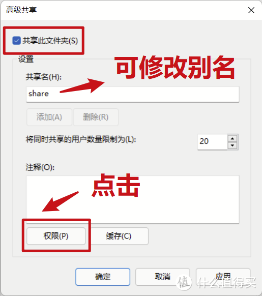

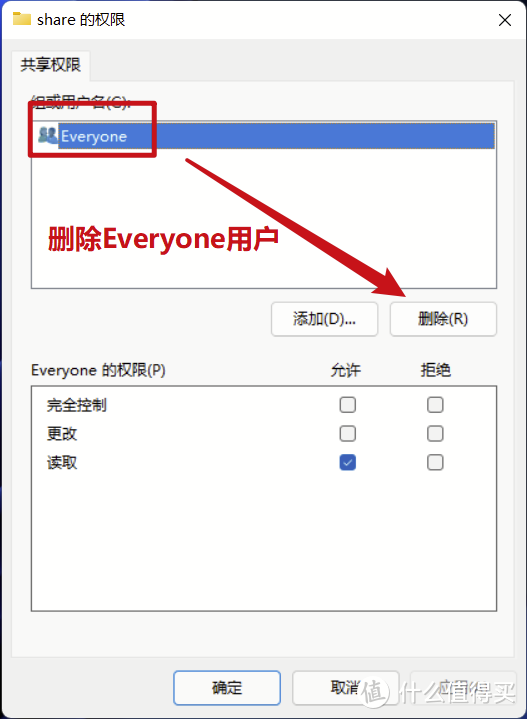

> 删除 Everyone 用户，不然谁都可以进行访问就不好了

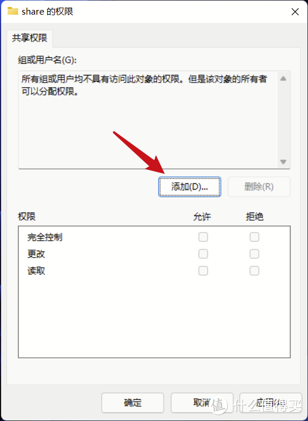

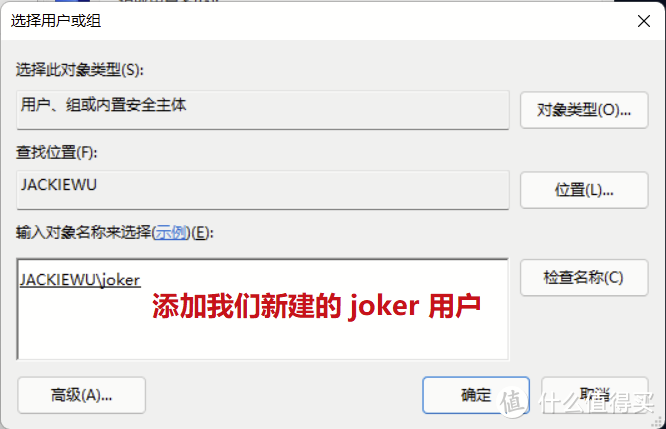


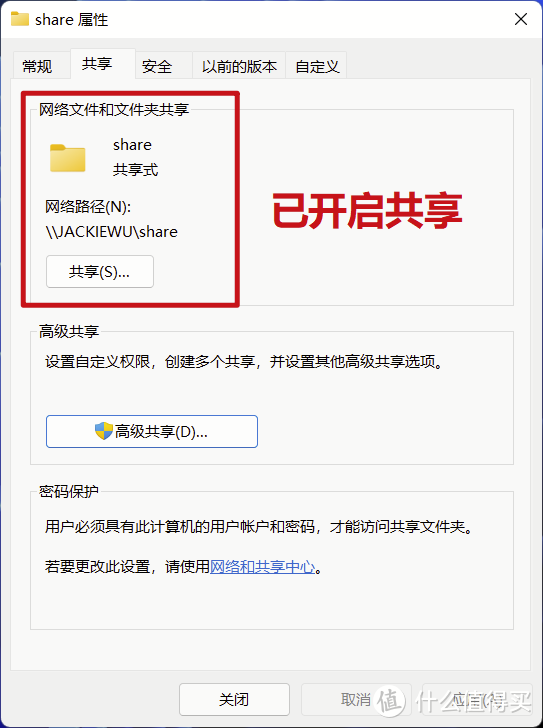

> 上图中的“网络路径”：我们可以在资源管理器的地址栏中输入此地址来访问，但是不建议采用此种方式。

我们设置好了文件夹的共享，并且此文件夹只有 "joker" 用户以及我们管理员用户才能进行访问，接下来教大家如何正确的访问我们共享的文件夹。

## 七、添加证书，并通过映射网络驱动器来访问共享的文件夹

这里我们用另一个 Windows 系统来访问我们设置好的 "share" 文件夹。

此处关于 SMB 证书的相关知识，可以看另一篇文章：

[unRaid SMB 共享：基于Windows 10 下的 SMB 问题深入分析及解决方式 ](https://post.smzdm.com/p/a7dmllm9/)

### 1. 添加 Windows 凭证

首先，我们在另一台 Windows 系统上，可以先手动生成一份证书保存到系统中，这样以后我们在去访问 "share" 文件夹时就不需要手动输入 "joker" 用户的账号和密码了：

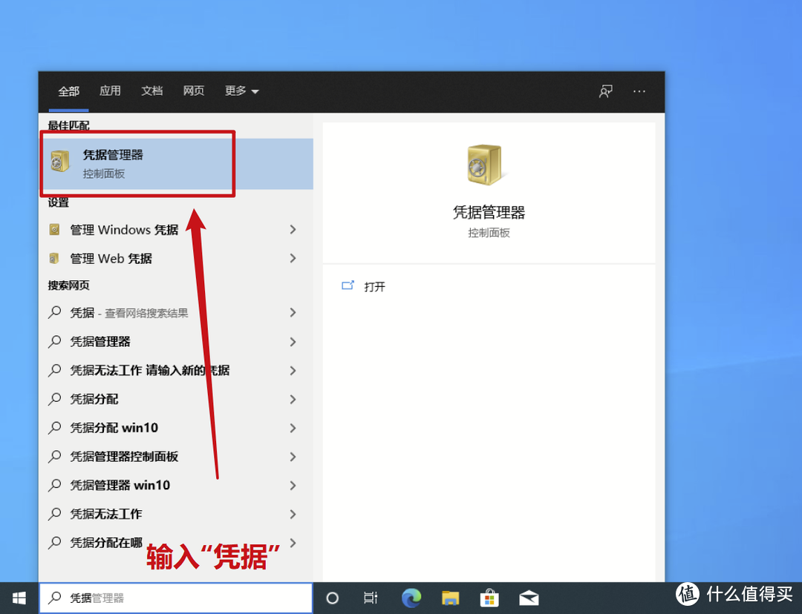

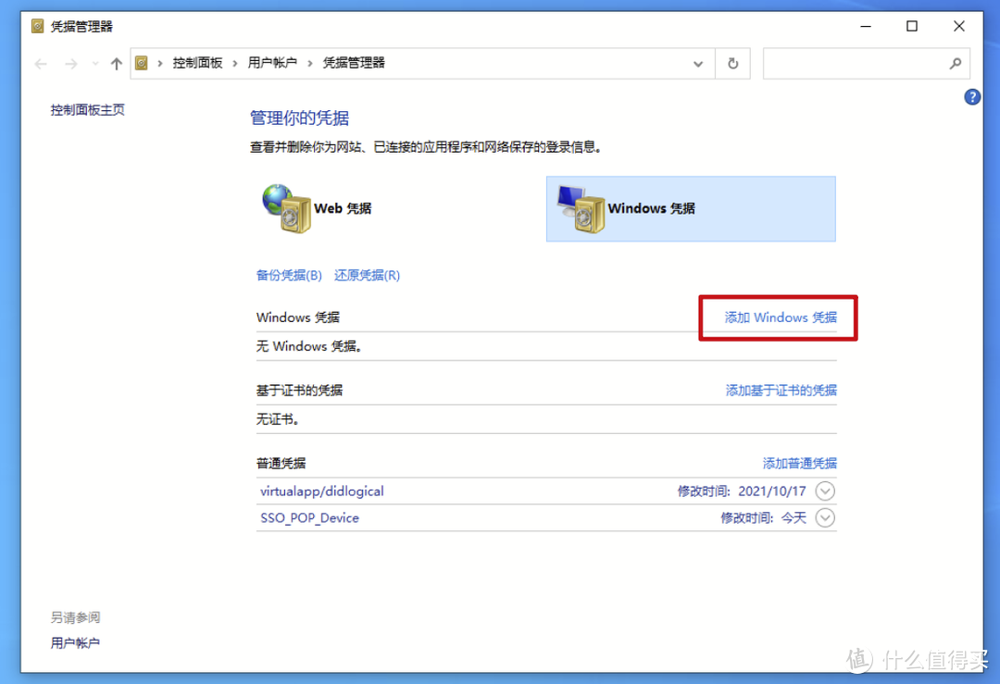

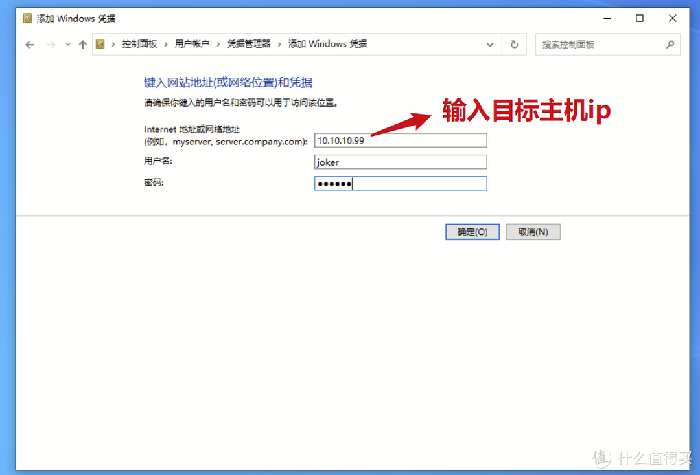

> 注意，这里的地址我们不要用主机名的形式，而应该用ip地址

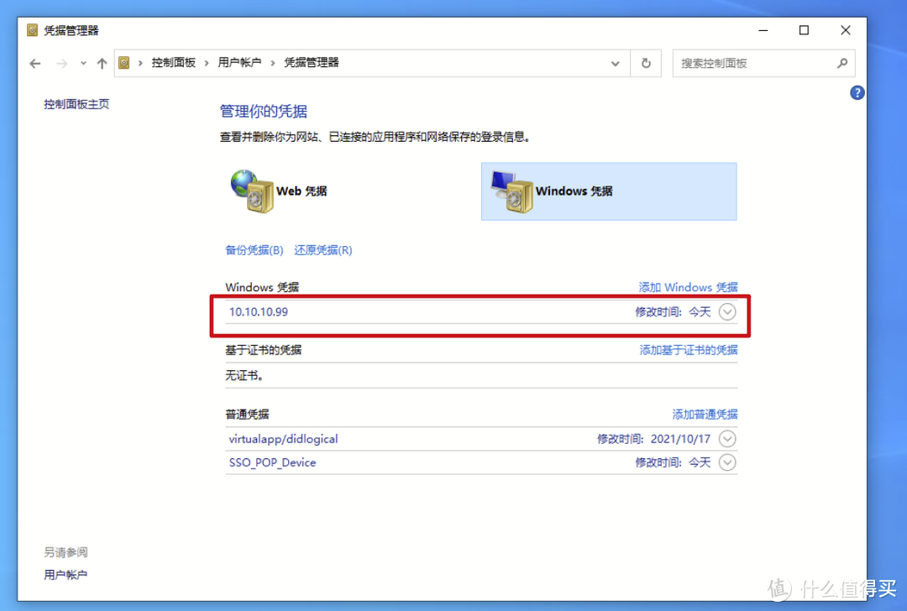

> 添加完成

### 2. 映射网络驱动器

这里，我们不要使用网络面板的形式去访问我们设置的 "share" 文件夹（如果你跟着 UP 的设置，在上面关闭了网络发现，那么通过网络面板是找不到我们的主机的），而应该是使用“映射网络启动器”的形式：

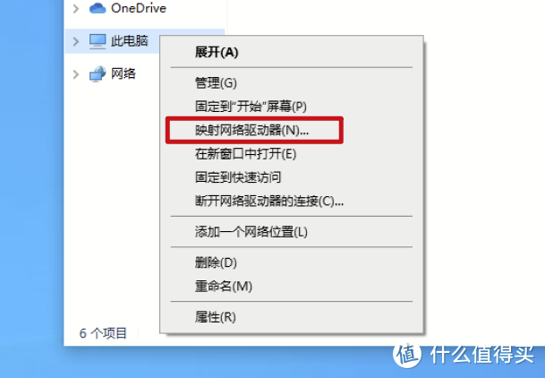

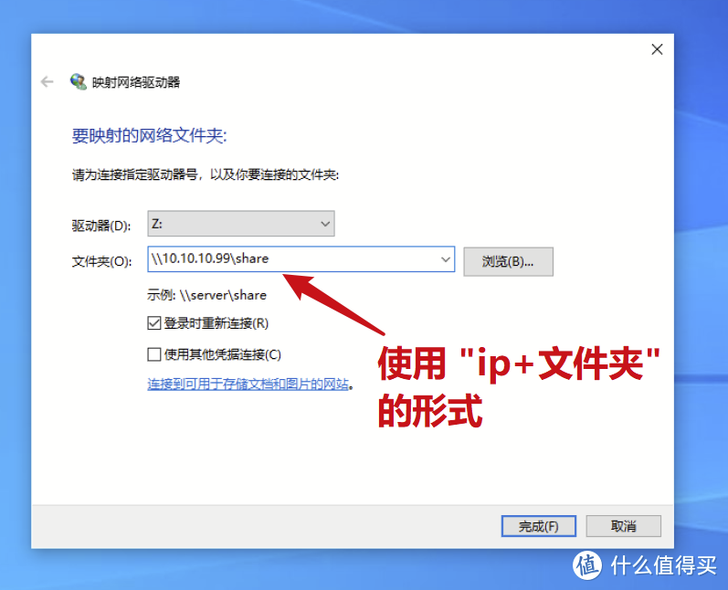

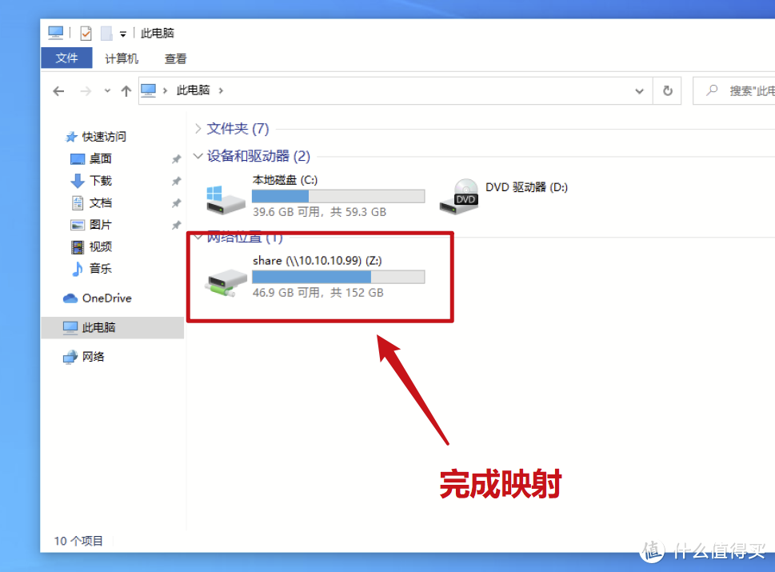

**至此，我们完成所有的相关设置，并已经能够正确的访问我们设置的共享文件夹了。**

## 八、总结

我们来回顾一下本文的重点：

- 为了数据的安全，我们不应该去使用 SMB1 协议；

- 我们可以新建一个低权限的用户来使用 SMB 共享，做到安全的隔离；

- 在本地安全策略中，应该禁止启用“来宾”身份相关的安全设置；

- 我们在启用网络发现时，应该开启密码保护；

- 不建议通过“网络”面板去访问共享资源，而应该是使用“映射网络驱动器”的形式；
